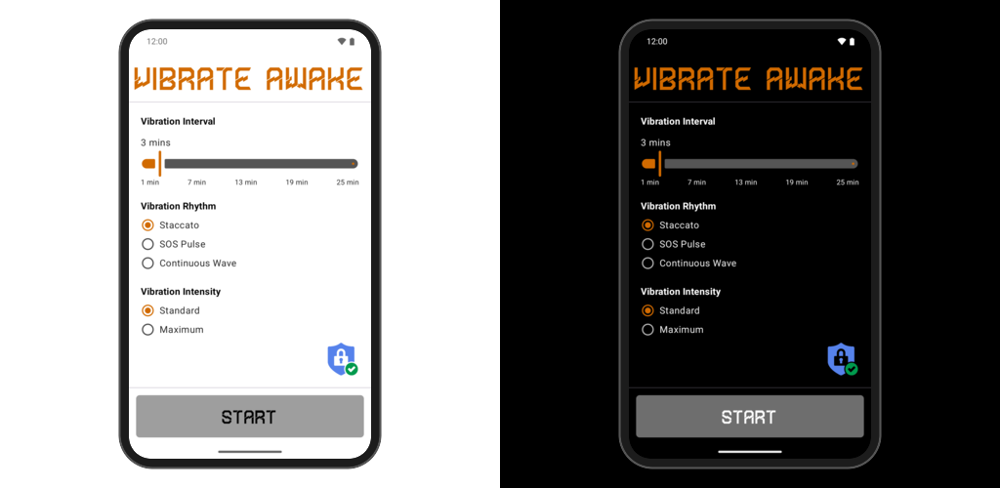
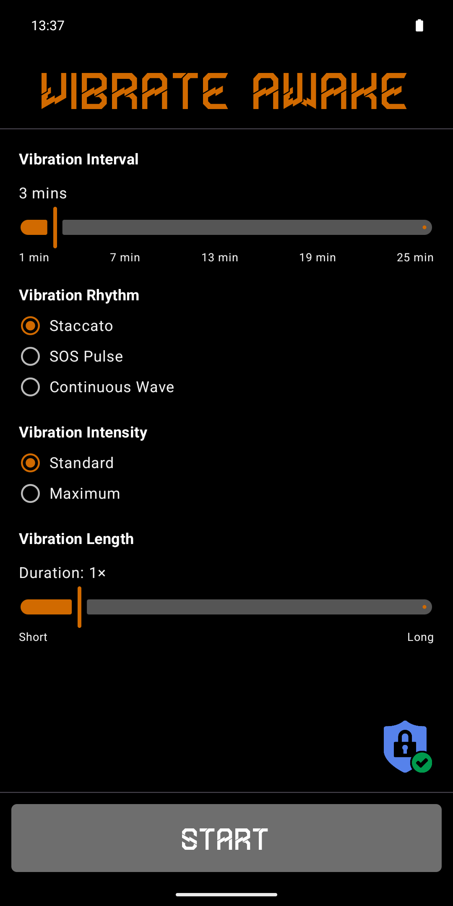
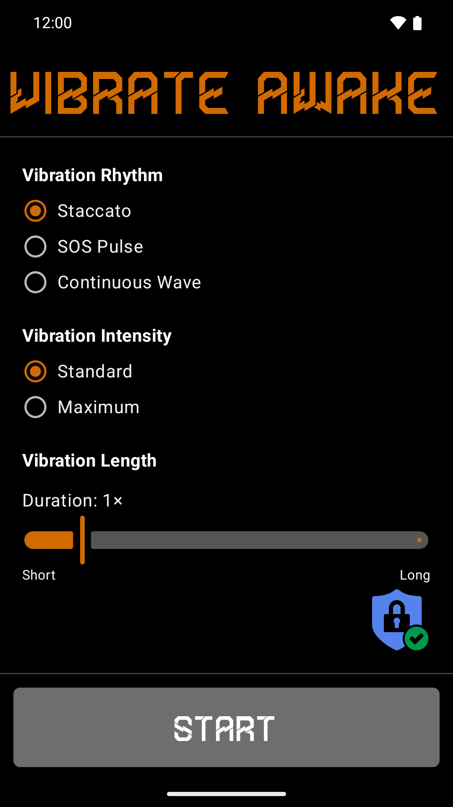
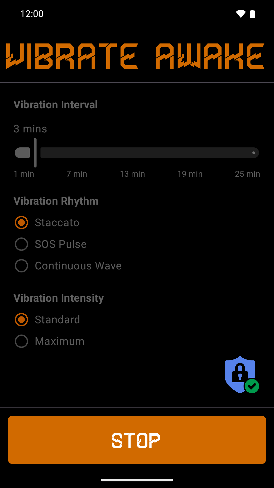
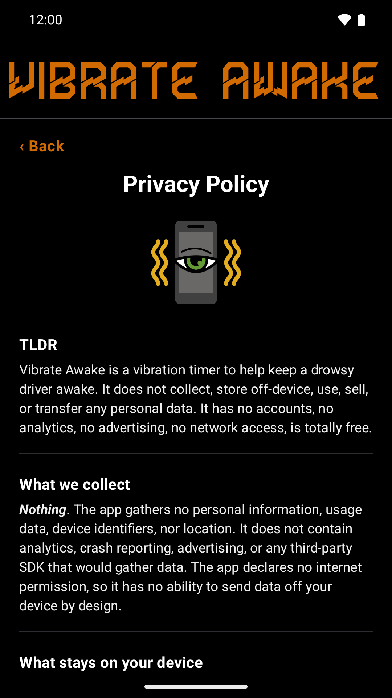
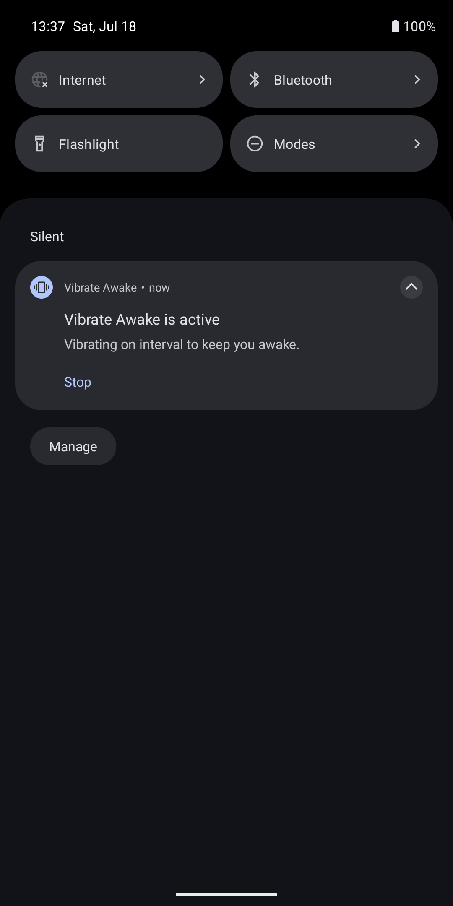
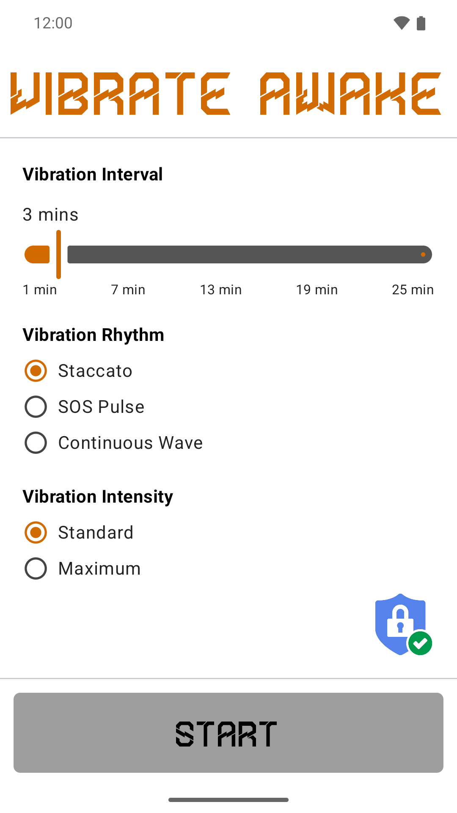

# Vibrate Awake



> A simple, offline Android app that buzzes your phone on a set interval to help
> you stay alert on long drives, night shifts, and late trips home. Set it once,
> press Start, and put the phone down; a foreground service keeps it vibrating
> even with the screen off and locked, until you press Stop. Nothing to tap or
> dismiss while you drive. This file documents what it does, how it is built,
> and how to run it.

---

> ### Table of Contents
> - [What it does](#what-it-does)
> - [Settings](#settings)
> - [How it works](#how-it-works)
> - [Screenshots](#screenshots)
> - [Play Store beta testing](#play-store-beta-testing)
> - [Project layout](#project-layout)
> - [Build and run](#build-and-run)
> - [Toolchain](#toolchain)
> - [Design notes](#design-notes)
> - [Privacy](#privacy)
> - [License](#license)

---

## What it does

The whole app is one screen: a settings form with three knobs and a large
Start/Stop button across the bottom. Press Start and it buzzes your phone on
your chosen interval to help you stay alert on long drives, night shifts, and
late trips home. Press Stop, in the app or from the notification, and it ends.

The design is deliberately distraction-free. There is nothing to tap or dismiss
while you drive. It just vibrates.

The published Play Store listing text lives in
[store/listing/full-description.txt](./store/listing/full-description.txt), with
the short description and title alongside it.

- **Fires immediately.** Start plays your chosen pattern at once, so you feel exactly what you picked before setting off.
- **Runs locked.** A foreground service keeps the vibration going with the screen off and the phone locked.
- **Fights habituation.** The interval is jittered by up to 15 seconds each cycle so your brain cannot anticipate the buzz, and a faint pre-warn pulse fires about 15 seconds before each main alert so a hard buzz never startles you mid-steer.
- **Greyscale with an orange accent.** A black-and-white UI that follows the system light or dark setting. A fixed orange (`#D16A00`) picks out the title, the slider fill, the selected options, and the Stop button while running. The title and Start/Stop button use the embedded Thunderline font; everything else is Roboto.

---

## Settings

**Fatigue Level.** How often it buzzes. Presets of 3, 5, and 10 minutes, plus a slider from 1 to 25 minutes in 30-second steps. The short end is "Extreme Fatigue", the long end "Preventative". Default is 3 minutes.

**Vibration Rhythm.** The waveform of each alert.
- **Staccato** (default): an escalating heartbeat, soft then medium then a hard final burst.
- **SOS Pulse**: three quick maximum-intensity jabs.
- **Continuous Wave**: a rising and falling siren.

**Vibration Intensity.** How hard the pulses hit.
- **Standard** (default): uses each rhythm's natural amplitude curve, gentle to strong.
- **Maximum**: fires every active pulse at full 255 amplitude.

The Fatigue Level label reads "Drag the slider for a custom time interval" while a preset is selected, then switches to "Custom time interval: X mins" once you move the slider off a preset. Settings persist across launches. While the service is running every control dims and locks, leaving the orange Stop button as the only action.

---

## How it works

**`VibrationEngine`** owns the schedule. It runs on the main looper, computes the next delay as `interval ± up to 15s` with a 30-second floor, schedules a faint pre-warn one-shot 15 seconds ahead of each main alert, then plays the selected waveform with `VibrationEffect.createWaveform`. The Maximum intensity rewrites every active amplitude to 255.

**`VibrateAwakeService`** is a foreground service that houses the engine and a partial wake lock, so alerts keep firing under Doze and while locked. It reads the config from the launch intent's extras, posts an ongoing low-importance notification with a Stop action, and returns `START_REDELIVER_INTENT` so the config survives a process restart.

**`MainViewModel` and `SettingsRepository`** hold the config as a `StateFlow` backed by DataStore, and expose start and stop. **`ServiceState`** is a small singleton `StateFlow<Boolean>` the service flips so the UI knows whether to show Start or Stop.

**`MainActivity`** hosts the Compose UI and handles the runtime prompts: it requests `POST_NOTIFICATIONS` on Android 13+ and offers the battery-optimization exemption the first time you press Start. It also renders the in-app privacy policy (reached from the shield icon) and opens the contact links in the default browser with no referrer.

---

## Screenshots

| Main screen | Custom options | Running, locked |
| --- | --- | --- |
|  |  |  |

| Privacy policy | Notification | Light theme |
| --- | --- | --- |
|  |  |  |

---

## Play Store beta testing

The app is in closed testing on Google Play, so access is invite-only and takes two steps.

**1. Join the testers group.** The group is public, but its membership list is private, so you will not see other members. Join at [groups.google.com/g/vibrate-awake-testing](https://groups.google.com/g/vibrate-awake-testing).

**2. Opt in and install.** Once you are in the group, use either link with the same Google account:

- Android: [play.google.com/store/apps/details?id=style.xero.vibrateawake](https://play.google.com/store/apps/details?id=style.xero.vibrateawake)
- Web: [play.google.com/apps/testing/style.xero.vibrateawake](https://play.google.com/apps/testing/style.xero.vibrateawake)

The Play links only work for accounts that have joined the group first.

> [!IMPORTANT]
> We need 12 testers to keep the app installed for 14 days to pass beta testing and you only _need_ to run it once. Your testing support helps get this app to the Play Store as a free tool for everyone.

---

## Project layout

```
vibrateawake/
├── settings.gradle.kts               Root settings; repositories and module list
├── build.gradle.kts                  Top-level plugin declarations
├── gradle/
│   ├── libs.versions.toml            Version catalog (single source of truth)
│   └── wrapper/                      Pinned Gradle 9.6.1 wrapper
├── gradlew                           Wrapper launcher (use this to build)
├── local.properties                  SDK path; machine-specific, not committed
├── store/                            Play listing text, screenshots, feature graphic
└── app/
    ├── build.gradle.kts              The app module build script
    └── src/main/
        ├── AndroidManifest.xml       Permissions and the service declaration
        ├── java/style/xero/vibrateawake/
        │   ├── MainActivity.kt       Compose UI + permission/battery prompts
        │   ├── MainViewModel.kt      Config StateFlow + start/stop
        │   ├── SettingsRepository.kt DataStore persistence
        │   ├── ServiceState.kt       Running-state flag the UI observes
        │   ├── VibrationConfig.kt    Knobs, enums, and waveform data
        │   ├── VibrationEngine.kt    Scheduling + the actual vibration
        │   ├── VibrateAwakeService.kt Foreground service, wake lock, notification
        │   └── ui/theme/             Greyscale Material 3 theme, color, type
        └── res/
            ├── font/thunderline.ttf  Embedded display font (title + button)
            ├── drawable-nodpi/        Launcher illustration + privacy shield icon
            ├── drawable/              Icon layers + notification small icon
            ├── mipmap-anydpi-v26/     Adaptive launcher icon
            └── values, values-night/  Strings, window theme, colors
```

---

## Build and run

```sh
cd ~/.local/src/vibrateawake
./gradlew assembleDebug
```

The debug APK lands at `app/build/outputs/apk/debug/app-debug.apk`.

Install and launch on a connected device or emulator:

```sh
./gradlew installDebug
adb shell am start -n style.xero.vibrateawake/.MainActivity
```

The physical test device is a Pixel 6 connected over Wi-Fi, because the
Jamf-managed Mac blocks USB media. Reconnect it with `adb mdns services` then
`adb devices`. The full ADB workflow is in the ADB cheatsheet in the Atlas
notes. An emulator named `pixel7_api36` is also available:

```sh
emulator -avd pixel7_api36 &
adb wait-for-device
./gradlew installDebug
```

---

## Toolchain

Installed with Homebrew on Apple Silicon. The Android SDK lives at
`~/.local/share/android/sdk` under `$XDG_DATA_HOME`. The build pins JDK 21;
Homebrew pulled in JDK 26 as a `gradle` dependency, but AGP 9.3.0 is not
validated against 26. The relevant environment lives in
`~/.config/zsh/01-environment.zsh`.

| Component   | Version    |
| ----------- | ---------- |
| AGP         | 9.3.0      |
| Kotlin      | 2.2.10     |
| Gradle      | 9.6.1      |
| JDK         | 21         |
| Compose BOM | 2026.06.01 |
| compileSdk  | 37         |
| minSdk      | 26         |
| targetSdk   | 36         |

---

## Design notes

**Vibrations use `USAGE_ALARM`.** A vibration triggered from a background or foreground service with the default usage is attenuated to a barely-perceptible buzz and is dropped while the phone is locked. Tagging the effect with `AudioAttributes` set to `USAGE_ALARM` plays it at full strength from the background, with the screen off, and lets it through Do Not Disturb, which is exactly what a stay-awake alert needs.

**Special-use foreground service.** The service declares `foregroundServiceType="specialUse"` with the required subtype property, and on Android 14+ it calls the typed `startForeground` overload. It holds a `PARTIAL_WAKE_LOCK` for its lifetime so the timer keeps firing under Doze.

**AGP 9 built-in Kotlin.** AGP 9.0 folded Kotlin into the Android plugin, so there is no `org.jetbrains.kotlin.android` plugin. Only `com.android.application` and the Compose compiler plugin are applied, and the Compose plugin is pinned to Kotlin 2.2.10 to match the version AGP 9.3.0 bundles. A mismatch there breaks the build.

**Greyscale with an orange accent.** Material You dynamic color is turned off. The scheme maps background and text to black, white, and off-tones (`#222` and `#efefef`), and `surfaceVariant` and related roles are pinned to greys so nothing leaks the default purple tint. The one accent is orange (`#D16A00`, chosen to read on both black and white): the title, the slider active fill, selected radio buttons, and the Stop button while running. Locked controls dim, and a selected control's orange fades to `#BE5900`.

**Portrait lock.** `MainActivity` sets `android:screenOrientation="portrait"`. The single-column form is built for portrait and this is a set-and-forget utility, so the app stays upright instead of reflowing awkwardly in landscape.

**In-app privacy policy.** The shield icon opens a privacy screen that replaces the form while keeping the title, rendered as native Compose text. Its links open in the default browser via `ACTION_VIEW` with `EXTRA_REFERRER` cleared, so the destination gets no app referrer.

**Permissions.** `VIBRATE`, `WAKE_LOCK`, `FOREGROUND_SERVICE`, `FOREGROUND_SERVICE_SPECIAL_USE`, `POST_NOTIFICATIONS`, and `REQUEST_IGNORE_BATTERY_OPTIMIZATIONS`. The notification permission is requested at runtime on Android 13+, and the battery-optimization exemption is offered the first time you press Start so the OS does not throttle the timer.

---

## Privacy

Vibrate Awake collects no data, has no network access, and contains no ads or
tracking. Your settings stay in the app's private storage on the device. See
[PRIVACY.md](./PRIVACY.md) for the full policy.

---

## License

**Vibrate Awake** is released under the [MIT License](./LICENSE.txt), by [xero](https://x-e.ro)
